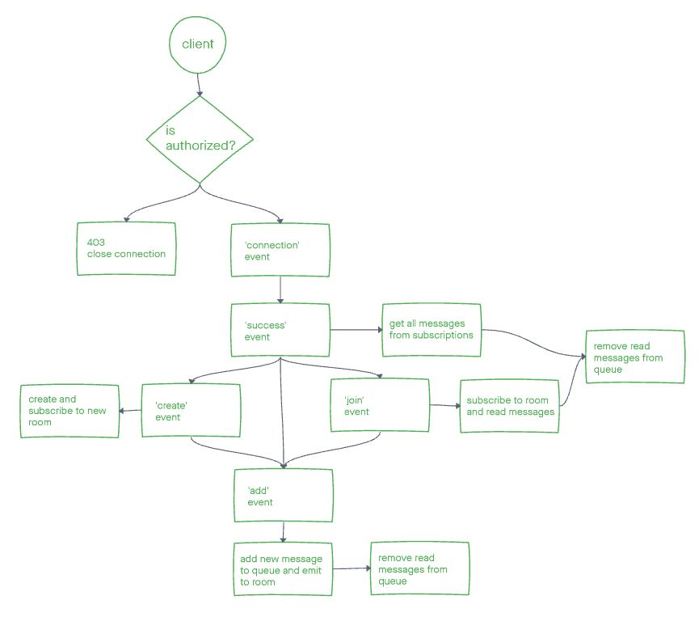

# Coding Academy Parcel Service

Write an event-driven system for managing packages in real-time. Communicate between vendors and drivers to ensure smooth delivery.

## Events

1. 'delivered'
1. 'pick up'
1. 'in transit'

## Whiteboard

