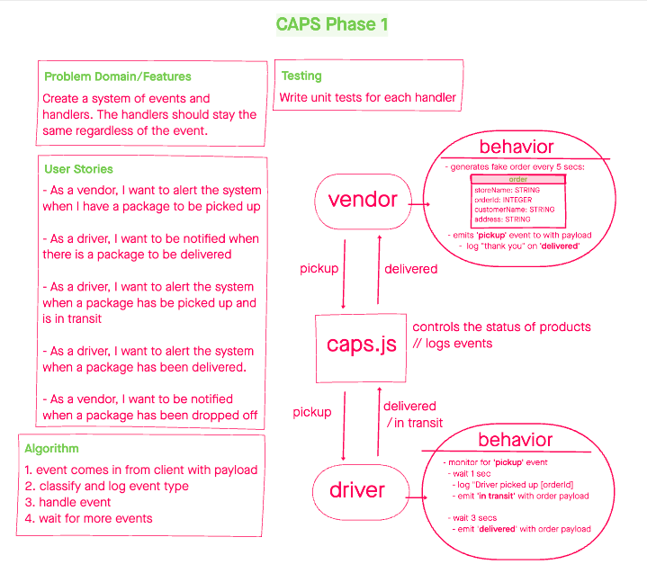

# Encored

An event driven chat service built with Socket.io and authenticated with web token.

## Events

### `connection`

1. client connects to server hub
1. receives all the enqueued messages from subscriptions

### `message`

1. client sends a message to the server hub
1. message is enqueued and sent to all subscribers

### `join`

1. client subscribes to a new room
1. client receives all enqueued messages
<!-- what does this entail? -->

### `create`

1. client creates a new room and subscribes to it

## Whiteboard

## API
